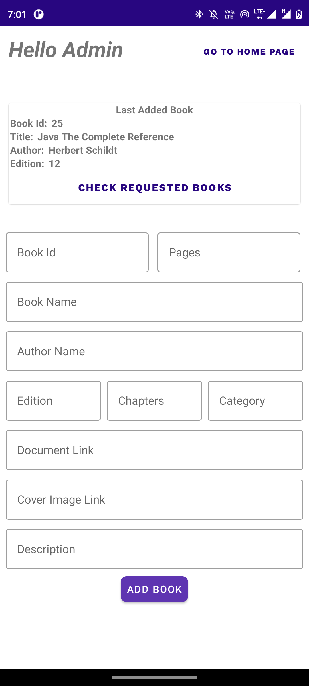

# Booklets-DBMS-Android-Project

## User view
A one-in-all tool that finds you what you're looking for.
The app features a home screen that displays books of all categories, although you can filter it to you're interests using the category filter on the top.
To refer to a specific book by its name, a search bar is available to look for all your needs.
A simple click on the book would take you to the detail page.
On the detail page you'll be provided with all the details of the book along with a button to download and save it to your device.
Incase you can't find the book you can make use of the Request Button, which'll direct you to the Request page of the app.
This is where you can submit the book and author names respectively and request the admin to add the book to the app database.

## Admin view
The admin can regularly check for any requests by the users using the request resolution page.
If a new book has been requested he/she will make use of the admin page and would add the book to the app database.
The admin and request resolution pages are only accessible by the admin and won't show to a normal user.
Once the requested books have been added the admin will remove the requests from the page confirming that there are no more requests to be resolved.

# Screenshots

